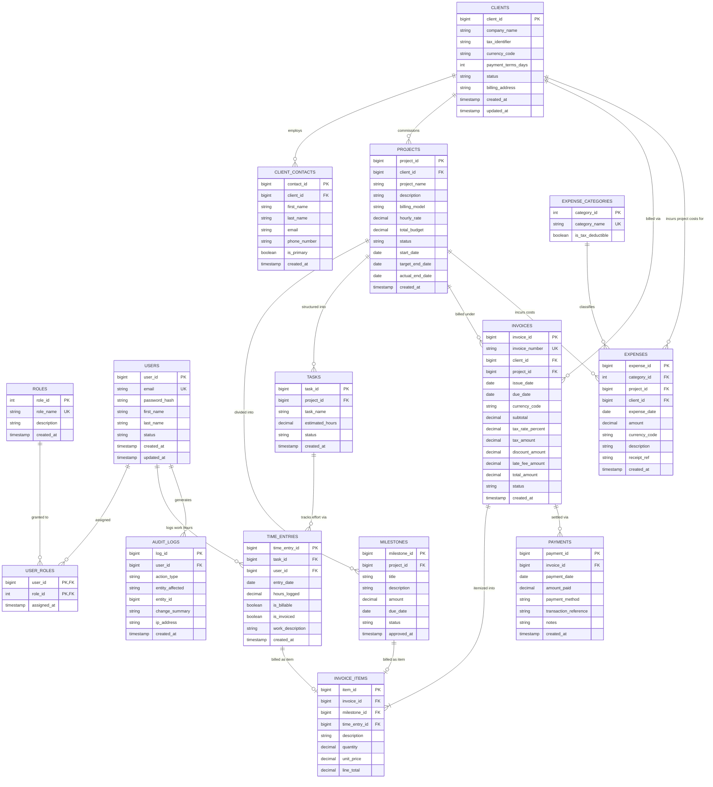

# Entity Relationship (ER) Diagram & Relational Mapping Specification

## Project Title
**Freelance & Client Management System with Freelancer Income & Client Analytics (FCMS Analytics)**

---

## 1. Complete ER Diagram Overview

The ER diagram below represents the complete relational structure for the **FCMS Analytics** platform. It comprises 15 normalized entities (3NF compliant), illustrating all primary keys, foreign keys, junction entities, and relationship cardinalities.

---

## 2. Mermaid ER Diagram

---

## 3. Crow's Foot Notation Explanation

Crow's Foot notation visually represents the cardinality and modality (optionality) of relationships between database entities:

| Notation Symbol | Symbol Meaning | Modality (Minimum) | Cardinality (Maximum) | System Context Example |
| :---: | :--- | :---: | :---: | :--- |
| `||` | **Exactly One** | Mandatory (1) | One (1) | Each `INVOICE_ITEM` belongs to **exactly one** parent `INVOICE`. |
| `|{` | **One or Many** | Mandatory (1) | Many ($N$) | An `INVOICE` must have at least **one or many** `INVOICE_ITEMS`. |
| `|o` | **Zero or One** | Optional (0) | One (1) | An `INVOICE_ITEM` optionally links to **zero or one** `MILESTONE`. |
| `}o` | **Zero or Many** | Optional (0) | Many ($N$) | A `CLIENT` may commission **zero or many** `PROJECTS`. |

---

## 4. Comprehensive Relationship & Foreign Key Verification

Every foreign key constraint in the FCMS database is documented below alongside parent and child table linkages:

### 1. `USER_ROLES` Junction Table
- `user_id` (FK $\rightarrow$ `USERS.user_id`)
- `role_id` (FK $\rightarrow$ `ROLES.role_id`)
- **Relationship:** Many-to-Many ($M:N$) between `USERS` and `ROLES`.

### 2. `CLIENT_CONTACTS` Table
- `client_id` (FK $\rightarrow$ `CLIENTS.client_id`)
- **Relationship:** One-to-Many ($1:N$) from `CLIENTS` to `CLIENT_CONTACTS`.

### 3. `PROJECTS` Table
- `client_id` (FK $\rightarrow$ `CLIENTS.client_id`)
- **Relationship:** One-to-Many ($1:N$) from `CLIENTS` to `PROJECTS`.

### 4. `MILESTONES` Table
- `project_id` (FK $\rightarrow$ `PROJECTS.project_id`)
- **Relationship:** One-to-Many ($1:N$) from `PROJECTS` to `MILESTONES`.

### 5. `TASKS` Table
- `project_id` (FK $\rightarrow$ `PROJECTS.project_id`)
- **Relationship:** One-to-Many ($1:N$) from `PROJECTS` to `TASKS`.

### 6. `TIME_ENTRIES` Table
- `task_id` (FK $\rightarrow$ `TASKS.task_id`)
- `user_id` (FK $\rightarrow$ `USERS.user_id`)
- **Relationships:** One-to-Many ($1:N$) from `TASKS` to `TIME_ENTRIES`; One-to-Many ($1:N$) from `USERS` to `TIME_ENTRIES`.

### 7. `INVOICES` Table
- `client_id` (FK $\rightarrow$ `CLIENTS.client_id`)
- `project_id` (FK $\rightarrow$ `PROJECTS.project_id` - Nullable for multi-project billing)
- **Relationships:** One-to-Many ($1:N$) from `CLIENTS` to `INVOICES`; Zero/One-to-Many ($0/1:N$) from `PROJECTS` to `INVOICES`.

### 8. `INVOICE_ITEMS` Table
- `invoice_id` (FK $\rightarrow$ `INVOICES.invoice_id`)
- `milestone_id` (FK $\rightarrow$ `MILESTONES.milestone_id` - Nullable)
- `time_entry_id` (FK $\rightarrow$ `TIME_ENTRIES.time_entry_id` - Nullable)
- **Relationships:** Mandatory One-to-Many ($1:N$) from `INVOICES` to `INVOICE_ITEMS`; Optional One-to-One ($0:1$) from `MILESTONES` to `INVOICE_ITEMS`; Optional One-to-One ($0:1$) from `TIME_ENTRIES` to `INVOICE_ITEMS`.

### 9. `PAYMENTS` Table
- `invoice_id` (FK $\rightarrow$ `INVOICES.invoice_id`)
- **Relationship:** One-to-Many ($1:N$) from `INVOICES` to `PAYMENTS`.

### 10. `EXPENSES` Table
- `category_id` (FK $\rightarrow$ `EXPENSE_CATEGORIES.category_id`)
- `project_id` (FK $\rightarrow$ `PROJECTS.project_id` - Nullable)
- `client_id` (FK $\rightarrow$ `CLIENTS.client_id` - Nullable)
- **Relationships:** One-to-Many ($1:N$) from `EXPENSE_CATEGORIES` to `EXPENSES`; Optional One-to-Many ($0:N$) from `PROJECTS` and `CLIENTS` to `EXPENSES`.

### 11. `AUDIT_LOGS` Table
- `user_id` (FK $\rightarrow$ `USERS.user_id` - Nullable for background system processes)
- **Relationship:** Optional One-to-Many ($0:N$) from `USERS` to `AUDIT_LOGS`.

---

## 5. Detailed Cardinality & Modality Matrix

| Parent Entity | Child Entity | Parent Modality | Child Modality | Cardinality | Business Explanation |
| :--- | :--- | :---: | :---: | :---: | :--- |
| `USERS` | `USER_ROLES` | Mandatory (1) | Optional (0) | $1 : N$ | A user can be assigned 1 or many roles. |
| `ROLES` | `USER_ROLES` | Mandatory (1) | Optional (0) | $1 : N$ | A role can apply to zero or many users. |
| `CLIENTS` | `CLIENT_CONTACTS` | Mandatory (1) | Optional (0) | $1 : N$ | A newly onboarded client may initially have zero contacts before contacts are added. |
| `CLIENTS` | `PROJECTS` | Mandatory (1) | Optional (0) | $1 : N$ | A client may exist in CRM without active project contracts initially. |
| `PROJECTS` | `MILESTONES` | Mandatory (1) | Optional (0) | $1 : N$ | Fixed-price projects contain 1 or more milestones; hourly projects may have 0 milestones. |
| `PROJECTS` | `TASKS` | Mandatory (1) | Optional (0) | $1 : N$ | Projects contain tasks for tracking progress and hours. |
| `TASKS` | `TIME_ENTRIES` | Mandatory (1) | Optional (0) | $1 : N$ | Tasks accumulate logged work entries over time. |
| `USERS` | `TIME_ENTRIES` | Mandatory (1) | Optional (0) | $1 : N$ | A freelancer user logs multiple work time records. |
| `CLIENTS` | `INVOICES` | Mandatory (1) | Optional (0) | $1 : N$ | Invoices are issued to clients over time. |
| `PROJECTS` | `INVOICES` | Optional (0) | Optional (0) | $0/1 : N$ | Invoices can be associated with a specific project or cover multi-project billing. |
| `INVOICES` | `INVOICE_ITEMS` | Mandatory (1) | Mandatory (1) | $1 : N$ | An invoice cannot exist without at least one line item (mandatory parent & child). |
| `MILESTONES` | `INVOICE_ITEMS` | Optional (0) | Optional (0) | $0 : 1$ | A milestone maps to at most 1 invoice line item once invoiced. |
| `TIME_ENTRIES` | `INVOICE_ITEMS` | Optional (0) | Optional (0) | $0 : 1$ | A billable time entry maps to at most 1 invoice line item once billed. |
| `INVOICES` | `PAYMENTS` | Mandatory (1) | Optional (0) | $1 : N$ | An invoice can be paid in full (1 payment) or incrementally (multiple partial payments). |
| `EXPENSE_CAT` | `EXPENSES` | Mandatory (1) | Optional (0) | $1 : N$ | Expenses are categorized under a specific expense category. |
| `USERS` | `AUDIT_LOGS` | Optional (0) | Optional (0) | $0 : N$ | User actions generate audit records; system background events have null `user_id`. |
